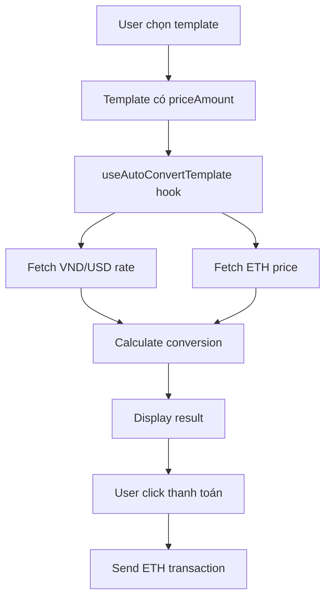

# 🏴‍☠️ Currency Converter System - GenG Style

## Tổng quan

Hệ thống chuyển đổi tiền tệ tự động từ **VND sang ETH** với tỷ giá thời gian thực, được thiết kế đặc biệt cho thanh toán thiệp cưới bằng cryptocurrency.

## ✨ Tính năng chính

- 🚀 **Real-time conversion**: Tỷ giá cập nhật mỗi 5 phút
- 💎 **Auto-conversion**: Tự động chuyển đổi dựa trên giá template
- 🔄 **Fallback system**: Backup rates khi API không khả dụng
- 📱 **Responsive UI**: Giao diện đẹp trên mọi device
- ⚡ **Performance**: Cache rates và parallel API calls
- 🛡️ **Error handling**: Xử lý lỗi graceful với fallback

## 🏗️ Kiến trúc hệ thống

```
services/currency/
├── currencyConverter.ts     # Core service class
├──
hooks/
├── useCurrencyConverter.ts  # React hooks
├──
components/
├── CurrencyDisplay.tsx      # UI component
├──
routes/
├── currencyRoutes.js        # Backend API
├──
app/
├── currency-demo/           # Demo page
├── checkout/[id]/           # Checkout integration
```

## 🔧 Cách sử dụng

### 1. Basic Usage với Hook

```typescript
import { useCurrencyConverter } from "@/hooks/useCurrencyConverter";

function MyComponent() {
  const converter = useCurrencyConverter();

  const handleConvert = async () => {
    await converter.convertAmount(2000000); // 2 triệu VND
  };

  return (
    <div>
      {converter.conversionResult && (
        <p>ETH: {converter.conversionResult.formattedEth}</p>
      )}
    </div>
  );
}
```

### 2. Auto-conversion cho Template

```typescript
import { useAutoConvertTemplate } from "@/hooks/useCurrencyConverter";

function CheckoutPage({ template }) {
  // Tự động convert khi template.priceAmount thay đổi
  const converter = useAutoConvertTemplate(template?.priceAmount);

  return (
    <CurrencyDisplay
      conversionResult={converter.conversionResult}
      isLoading={converter.isLoading}
      error={converter.error}
      onRefresh={converter.refreshRates}
    />
  );
}
```

### 3. Backend API Usage

```javascript
// GET /api/currency/convert?vnd=2000000
const response = await fetch("/api/currency/convert?vnd=2000000");
const data = await response.json();

console.log(data.data.formattedEth); // "0.000234 ETH"
```

## 🎯 Integration với Checkout

Checkout page đã được tích hợp sẵn currency converter:

1. **Auto-load rates**: Khi page load, tự động fetch tỷ giá
2. **Auto-convert**: Khi có template price, tự động convert sang ETH
3. **Real-time display**: Hiển thị conversion result với UI đẹp
4. **Smart button**: Button thanh toán hiển thị số ETH chính xác
5. **Error handling**: Xử lý lỗi network, invalid data gracefully

## 📊 API Endpoints

### GET /api/currency/convert

Chuyển đổi VND sang ETH

**Parameters:**

- `vnd` (required): Số tiền VND cần chuyển đổi

**Response:**

```json
{
  "success": true,
  "data": {
    "vndAmount": 2000000,
    "usdAmount": 83.33,
    "ethAmount": 0.000234,
    "ethPriceUsd": 3500.0,
    "formattedEth": "0.000234",
    "formattedVnd": "2,000,000",
    "formattedUsd": "83.33",
    "lastUpdate": "2025-01-27T10:30:00.000Z"
  }
}
```

### GET /api/currency/rates

Lấy tỷ giá hiện tại

**Response:**

```json
{
  "success": true,
  "data": {
    "vndToUsd": 0.0000416,
    "ethPriceUsd": 3500.0,
    "vndPerUsd": 24000,
    "ethChange24h": 2.5,
    "lastUpdate": "2025-01-27T10:30:00.000Z"
  }
}
```

## 🔄 Flow hoạt động



## 🛠️ Configuration

### Environment Variables

```env
# Optional: Custom API keys nếu cần
EXCHANGE_RATE_API_KEY=your_key_here
COINCAP_API_KEY=your_key_here
```

### Fallback Rates

Khi API không khả dụng, system sử dụng fallback rates:

- VND/USD: 1/24000 (≈24,000 VND = 1 USD)
- ETH Price: $2500

### Cache Duration

- Default: 5 phút
- Có thể config trong `currencyConverter.ts`

## 🎨 UI Components

### CurrencyDisplay

Component chính để hiển thị conversion result:

```typescript
<CurrencyDisplay
  conversionResult={result}
  isLoading={false}
  error={null}
  onRefresh={() => refreshRates()}
  showRefreshButton={true}
  className="custom-class"
/>
```

### Features:

- 📊 Detailed conversion breakdown
- 🔄 Manual refresh button
- ⏰ Last update timestamp
- 🎨 Beautiful responsive design
- 🌙 Dark mode support

## 🧪 Testing

### Demo Page

Truy cập `/currency-demo` để test functionality:

- Input custom amounts
- Preset amounts (500K, 1M, 2M, 5M)
- Real-time conversion
- Error handling demo

### Manual Testing

```javascript
// Test conversion
const converter = new CurrencyConverter();
const result = await converter.convertVndToEth(2000000);
console.log(result);

// Test rates
const rates = await converter.getCurrentRates();
console.log(rates);
```

## 🚀 Performance Optimizations

1. **Parallel API calls**: Fetch VND và ETH rates cùng lúc
2. **Smart caching**: Cache rates trong 5 phút
3. **Lazy loading**: Chỉ load khi cần thiết
4. **Error boundaries**: Graceful degradation
5. **Memoization**: React hooks được optimize

## 🔒 Security & Error Handling

- ✅ Input validation
- ✅ Rate limiting (API level)
- ✅ Fallback mechanisms
- ✅ Type safety với TypeScript
- ✅ Error boundaries
- ✅ Network timeout handling

## 📈 Future Enhancements

- [ ] Support multiple cryptocurrencies (BTC, USDT, etc.)
- [ ] Historical rate charts
- [ ] Price alerts
- [ ] Advanced caching strategies
- [ ] WebSocket real-time updates
- [ ] Multi-language support

## 🎯 Best Practices

1. **Always handle loading states**
2. **Provide fallback UI for errors**
3. **Cache conversion results when possible**
4. **Use TypeScript for type safety**
5. **Test with various network conditions**
6. **Monitor API rate limits**

## 🏴‍☠️ GenG Code Style

Code được viết theo phong cách GenG:

- 🚀 Performance-first approach
- 💎 Clean, readable code
- ⚡ Modern React patterns
- 🛡️ Robust error handling
- 🎨 Beautiful UI/UX
- 📱 Mobile-first design

---

**Coded with ❤️ by a seasoned pirate developer! 🏴‍☠️**
